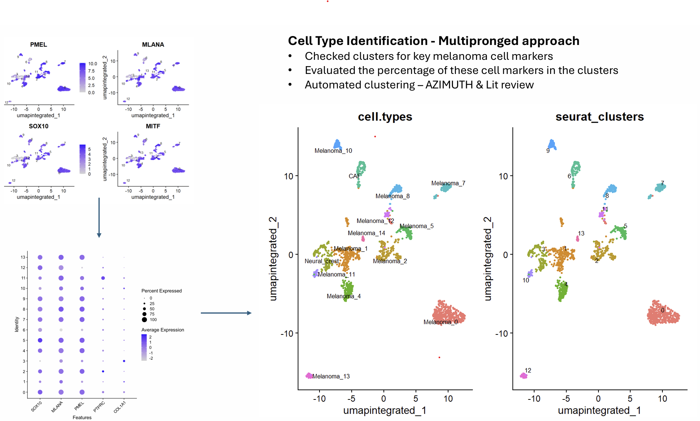

# Single-Cell RNA-seq: Melanoma Heterogeneity and Tumour Microenvironment

## Biological question

Melanoma is a highly heterogeneous cancer, meaning tumour cells within the same patient can exist in very different biological states. This heterogeneity influences how tumours respond to treatment, particularly to Immune Checkpoint Inhibitors (ICIs), which work by reactivating the immune system to attack cancer cells.

This analysis asks: what changes occur in the Tumour Microenvironment (TME) between ICI-naive and ICI-treated patients, including both responders and non-responders? What does the single-cell transcriptomic landscape reveal about the underlying biology driving these differences?

---

## Data

- **Source:** Combined scRNA-seq data from two melanoma studies
- **Sample type:** Melanoma biopsies from patients receiving different therapies
- **Therapies represented:** ICI alone, ICI combined with chemotherapy, ICI combined with targeted therapy
- **Cell content:** Both tumour and non-tumour cells
- **Format:** 10x Genomics (gene-cell matrix, gene IDs, cell barcodes, metadata)
- **Groups of interest:**
  - ICI-naive patients
  - ICI-treated responders
  - ICI-treated non-responders

---

## Analysis overview

1. Quality control and filtering, retaining cells with 1,000 to 10,000 detected genes
2. Normalisation and dimensionality reduction using PCA and UMAP
3. Batch correction and patient integration using Harmony
4. Unsupervised clustering to identify cell populations
5. Cell type annotation using marker genes, dot plots, and automated annotation with Azimuth
6. Differentiation state scoring across four melanoma states: undifferentiated, neural crest, transitory, and melanocytic
7. Mutational status analysis comparing NRAS Q61L and BRAF V600E tumours
8. Cell-cell communication analysis using CellChat, with a focus on WNT signalling

---

## Repository structure

```
Single-Cell-Omics-on-Melanoma/
├── melanoma.R                             # Full analysis pipeline
└── Single Cell OMICS Melanoma Cell Types  # Cell type annotation reference
```

---

## Key tools and packages

- **R** with Bioconductor
- Seurat for single-cell analysis
- Harmony for batch correction and patient integration
- CellChat for cell-cell communication analysis
- clusterProfiler for pathway enrichment
- Azimuth for automated cell type annotation
- ggplot2 for visualisation

---

## Key findings

**Tumour heterogeneity and cell states**

14 transcriptionally distinct clusters were identified, each defined by a unique set of marker genes. The heatmap below shows the top 5 marker genes per cluster, confirming that each cluster has a distinct transcriptional fingerprint. Clusters that are spatially close on the UMAP share some top genes, for example clusters 1, 3, and 4.


Three dominant differentiation states were mapped across clusters: melanocytic, neural crest, and undifferentiated. The presence of multiple differentiation states within the same tumour confirms that melanoma cells exist along a phenotypic spectrum, which has direct implications for treatment response.

**Cell type identification**

A multipronged approach was used to identify cell types across all clusters, combining manual marker gene evaluation, dot plot visualisation of key melanoma markers including SOX10, MLANA, PMEL, PTPRC and COL1A1, and automated annotation using Azimuth.



**Mutational status shapes tumour phenotype**

Comparing NRAS Q61L and BRAF V600E tumours revealed over 15,900 differentially expressed genes. NRAS tumours were enriched for melanocyte differentiation and pigmentation pathways, suggesting a more differentiated phenotype. BRAF tumours were enriched for extracellular matrix organisation and cell-substrate adhesion pathways, suggesting a less differentiated and more invasive state. This distinction is clinically relevant because differentiation state influences sensitivity to targeted therapies.

**Tumour Microenvironment and cell-cell communication**

Extensive signalling interactions were detected across tumour and non-tumour cells, particularly between melanoma clusters and Cancer-Associated Fibroblasts (CAFs). WNT signalling was identified as a key pathway driving these interactions, with the WNT7B-FZD1-LRP5 ligand-receptor axis showing broad activity across multiple cell types. Autocrine signalling within melanoma clusters was also detected, suggesting self-sustaining tumour communication networks.

**Batch correction revealed inter-tumour heterogeneity**

Prior to integration, clusters were dominated by individual patients, reflecting strong batch effects. After Harmony integration, cells from different patients mixed within clusters. However, some clusters remained patient-enriched, indicating genuine biological differences between tumours rather than technical artefacts.

---

## Clinical relevance

Understanding which cell states and signalling pathways are present in ICI-naive versus ICI-treated tumours provides a transcriptional framework for explaining why some patients respond to immunotherapy and others do not. The identification of CAF-melanoma and WNT-mediated interactions points to stromal and microenvironmental factors that may suppress immune infiltration and limit treatment efficacy.
